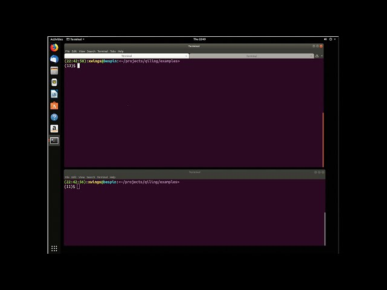
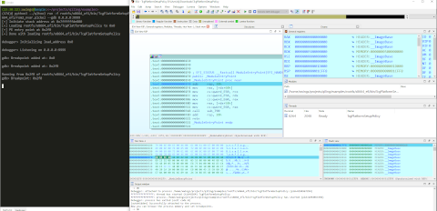

### Emulating a Windows EXE on a Linux machine.

Using Qiling Framework to emulate a Windows binary on a Linux machine.

Example code
```python
from qiling import *

# sandbox to emulate the EXE
def my_sandbox(path, rootfs):
    # setup Qiling engine
    ql = Qiling(path, rootfs)
    # now emulate the EXE
    ql.run()

if __name__ == "__main__":
    # execute Windows EXE under our rootfs
    my_sandbox(["examples/rootfs/x86_windows/bin/x86_hello.exe"], "examples/rootfs/x86_windows")
```


### Emulating Windows Registry
Emulating Windows registry with Qiling Framework

Example code
```python
import sys
sys.path.append("..")
from qiling import *
from qiling.const import QL_VERBOSE

def my_sandbox(path, rootfs):
    ql = Qiling(path, rootfs, verbose=QL_VERBOSE.DEBUG)
    ql.run()


if __name__ == "__main__":
    my_sandbox(["rootfs/x86_windows/bin/RegDemo.exe"], "rootfs/x86_windows")
```

Youtube video

[](https://www.youtube.com/watch?v=qq53McBh0mA)


### Catching Wannacry's killer swtich

This demo executed wannacry.bin (md5 41b5ba4bf74e65845fa8c9861ca34508) and look for the killerswitch url

Example code
```python
import sys
sys.path.append("..")
from qiling import *
from qiling.const import QL_VERBOSE

def stopatkillerswtich(ql):
    print("killerswtch found")
    ql.emu_stop()

if __name__ == "__main__":
    ql = Qiling(["rootfs/x86_windows/bin/wannacry.bin"], "rootfs/x86_windows", verbose=QL_VERBOSE.DEBUG)
    ql.hook_address(stopatkillerswtich, 0x40819a)
    ql.run()
```

Youtube video

[](https://www.youtube.com/watch?v=oRSX9SS5VFI)


### Dynamically patch a Windows crackme, make it always displays "Congratulation" dialog.

Using Qiling Framework to dynamically patch a Windows Crackme and making it always displays "Congratulation" dialog.

Example code
```python
from qiling import *

def force_call_dialog_func(ql):
    # get DialogFunc address
    lpDialogFunc = ql.unpack32(ql.mem.read(ql.arch.regs.esp - 0x8, 4))
    # setup stack memory for DialogFunc

    ql.stack_push(0)
    ql.stack_push(1001)
    ql.stack_push(273)
    ql.stack_push(0)
    ql.stack_push(0x0401018)
    # force EIP to DialogFunc
    ql.arch.regs.eip = lpDialogFunc


def my_sandbox(path, rootfs):
    ql = Qiling(path, rootfs)
    # NOP out some code
    ql.patch(0x004010B5, b'\x90\x90')
    ql.patch(0x004010CD, b'\x90\x90')
    ql.patch(0x0040110B, b'\x90\x90')
    ql.patch(0x00401112, b'\x90\x90')
    # hook at an address with a callback
    ql.hook_address(force_call_dialog_func, 0x00401016)
    ql.run()


if __name__ == "__main__":
    my_sandbox(["rootfs/x86_windows/bin/Easy_CrackMe.exe"], "rootfs/x86_windows")
```

Youtube video

[](https://www.youtube.com/watch?v=_0DpAYZODy8 "Video DEMO 2")


### GDBserver with IDAPro

Solving a simple CTF challenge with Qiling Framework and IDAPro

Youtube video

[](https://www.youtube.com/watch?v=SPjVAt2FkKA "Video DEMO 2")


### Solving malformed ELF header + Anti-Debug crackme, with Qiling GDBserver + Qiling qltool

Youtube video

[](https://www.youtube.com/watch?v=-Ipk0P3ppzo)


### Fuzzing with Qiling's AFL extension 

Qiling can be used to fuzz binary or firmware with AFL++'s unicorn mode

Note that the demo code may be outdated, more information on fuzzing with Qiling can be found [here](https://github.com/qilingframework/qiling/tree/master/examples/fuzzing).

The general steps should be like this:
```sh
# Build AFL++'s unicorn mode
git clone https://github.com/AFLplusplus/AFLplusplus.git -b dev
make -C AFLplusplus
cd AFLplusplus/unicorn_mode ; ./build_unicorn_support.sh

# Fuzz simple x86_64 binary
AFL_AUTORESUME=1 AFL_PATH="$(realpath ./AFLplusplus)" PATH="$AFL_PATH:$PATH" afl-fuzz -i afl_inputs -o afl_outputs -U -- python3 ./fuzz_x8664_linux.py @@
```

Example code
```python
# No more need for importing unicornafl, try afl.ql_afl_fuzz instead!
import os
import sys

from typing import Optional

sys.path.append("../../..")
from qiling import Qiling
from qiling.const import QL_VERBOSE
from qiling.extensions import pipe
from qiling.extensions import afl

def main(input_file: str):
    ql = Qiling(["./x8664_fuzz"], "../../rootfs/x8664_linux",
        verbose=QL_VERBOSE.OFF, # keep qiling logging off
        console=False)          # thwart program output

    # redirect stdin to our mock to feed it with incoming fuzzed keystrokes
    ql.os.stdin = pipe.SimpleInStream(sys.stdin.fileno())

    def place_input_callback(ql: Qiling, input: bytes, persistent_round: int) -> Optional[bool]:
        """Feed generated stimuli to the fuzzed target.

        This method is called with every fuzzing iteration.
        """

        # feed fuzzed input to our mock stdin
        ql.os.stdin.write(input)

        # signal afl to proceed with this input
        return True

    def start_afl(ql: Qiling):
        """Have Unicorn fork and start instrumentation.
        """

        afl.ql_afl_fuzz(ql, input_file=input_file, place_input_callback=place_input_callback, exits=[ql.os.exit_point])

    # get image base address
    ba = ql.loader.images[0].base

    # make the process crash whenever __stack_chk_fail@plt is about to be called.
    # this way afl will count stack protection violations as crashes
    ql.hook_address(callback=lambda x: os.abort(), address=ba + 0x1225)

    # set afl instrumentation [re]starting point. we set it to 'main'
    ql.hook_address(callback=start_afl, address=ba + 0x122c)

    # okay, ready to roll
    ql.run()

if __name__ == "__main__":
    if len(sys.argv) == 1:
        raise ValueError("No input file provided.")

    main(sys.argv[1])
```


Screenshot

[](https://github.com/qilingframework/qiling/blob/master/examples/fuzzing/linux_x8664/qilingfzz.png "Demo #2 Fuzzing with Qiling Unicornafl")


### Emulating Netgear R6220

Almost a complete emulation of Netgear R6220, a 32bit MIPS based router runs on a x86 64bit Ubuntu.

Example code

```python
import sys
sys.path.append("..")
from qiling import *
from qiling.os.posix import syscall
from qiling.const import QL_VERBOSE

def my_syscall_write(ql, write_fd, write_buf, write_count, *rest):
    if write_fd == 2 and ql.os.file_des[2].__class__.__name__ == 'ql_pipe':
        ql.os.definesyscall_return(-1)
    else:
        syscall.ql_syscall_write(ql, write_fd, write_buf, write_count, *rest)


def my_netgear(path, rootfs):
    ql = Qiling(
                path, 
                rootfs, 
                verbose      = QL_VERBOSE.DEBUG, 
                profile     = "netgear_6220.ql"
                )

    ql.root             = False
    ql.bindtolocalhost  = True
    ql.multithread      = False
    ql.add_fs_mapper('/proc', '/proc')
    ql.os.set_syscall(4004, my_syscall_write)
    ql.run()


if __name__ == "__main__":
    my_netgear(["rootfs/netgear_r6220/bin/mini_httpd",
                "-d","/www",
                "-r","NETGEAR R6220",
                "-c","**.cgi",
                "-t","300"], 
                "rootfs/netgear_r6220")
```

Youtube video

[](https://www.youtube.com/watch?v=Viy4gXwM4HE)


### Emulating ARM router firmware on Ubuntu X64 machine

Qiling Framework hot-patches and emulates ARM router's httpd on a X86_64Bit Ubuntu

Example code
```python
import os, socket, sys, threading
sys.path.append("..")
from qiling import *
from qiling.const import QL_VERBOSE

def patcher(ql):
    br0_addr = ql.mem.search("br0".encode() + b'\x00')
    for addr in br0_addr:
        ql.mem.write(addr, b'lo\x00')

def nvram_listener():
    server_address = 'rootfs/var/cfm_socket'
    data = ""
    
    try:  
        os.unlink(server_address)  
    except OSError:  
        if os.path.exists(server_address):  
            raise  

    # Create UDS socket  
    sock = socket.socket(socket.AF_UNIX,socket.SOCK_STREAM)  
    sock.bind(server_address)  
    sock.listen(1)  
  
    while True:  
        connection, client_address = sock.accept()  
        try:  
            while True:  
                data += str(connection.recv(1024))
        
                if "lan.webiplansslen" in data:  
                    connection.send('192.168.170.169'.encode())  
                elif "wan_ifname" in data:
                    connection.send('eth0'.encode())
                elif "wan_ifnames" in data:
                    connection.send('eth0'.encode())
                elif "wan0_ifname" in data:
                    connection.send('eth0'.encode())
                elif "wan0_ifnames" in data:
                    connection.send('eth0'.encode())
                elif "sys.workmode" in data:
                    connection.send('bridge'.encode())
                elif "wan1.ip" in data:
                    connection.send('1.1.1.1'.encode())
                else: 
                    break  
                data = ""
        finally:  
                connection.close() 

def my_sandbox(path, rootfs):
    ql = Qiling(path, rootfs, verbose=QL_VERBOSE.DEBUG)
    ql.add_fs_mapper("/dev/urandom","/dev/urandom")
    ql.hook_address(patcher ,ql.loader.elf_entry)
    ql.run()


if __name__ == "__main__":
    nvram_listener_therad =  threading.Thread(target=nvram_listener, daemon=True)
    nvram_listener_therad.start()
    my_sandbox(["rootfs/bin/httpd"], "rootfs")
```

Youtube video

[](https://www.youtube.com/watch?v=Nxu742-SNvw "Demo #3 Emulating ARM router firmware on Ubuntu X64 machine")


### Emulating UEFI

Qiling Framework emulates UEFI

```python
import sys
import pickle
sys.path.append("..")
from qiling import *
from qiling.os.uefi.const import *

def force_notify_RegisterProtocolNotify(ql, address, params):
    event_id = params['Event']
    if event_id in ql.loader.events:
        ql.loader.events[event_id]['Guid'] = params["Protocol"]
        # let's force notify
        event = ql.loader.events[event_id]
        event["Set"] = True
        ql.loader.notify_list.append((event_id, event['NotifyFunction'], event['NotifyContext']))
        ######
        return EFI_SUCCESS
    return EFI_INVALID_PARAMETER


if __name__ == "__main__":
    with open("rootfs/x8664_efi/rom2_nvar.pickel", 'rb') as f:
        env = pickle.load(f)
    ql = Qiling(["rootfs/x8664_efi/bin/TcgPlatformSetupPolicy"], "rootfs/x8664_efi", env=env)
    ql.os.set_api("hook_RegisterProtocolNotify", force_notify_RegisterProtocolNotify)
    ql.run()
```

Screenshot

[](https://github.com/qilingframework/rtfd.io/blob/master/docs/img/demo4-en.png "Demo #4 Emulating UEFI")
