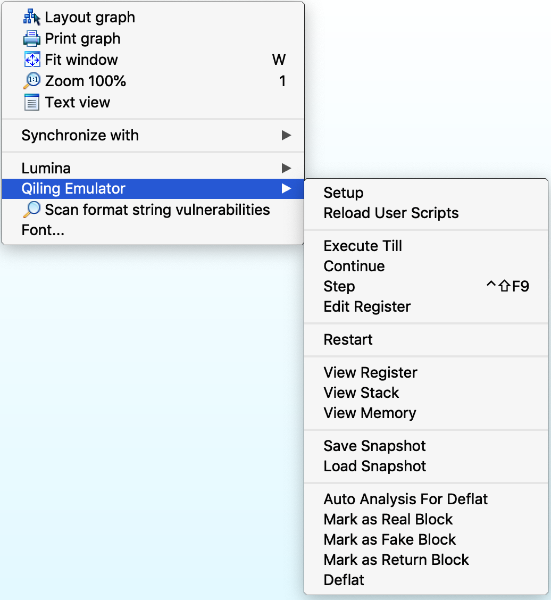
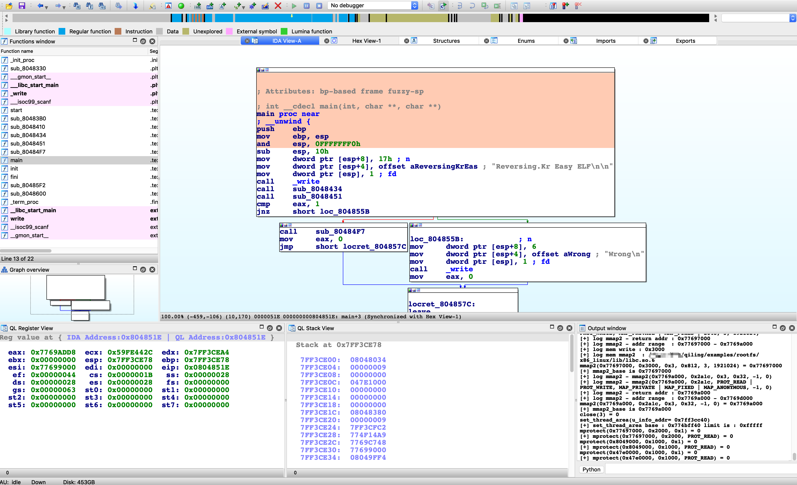
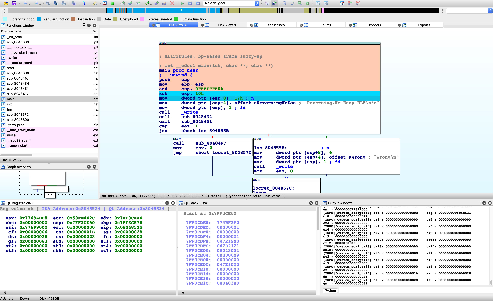
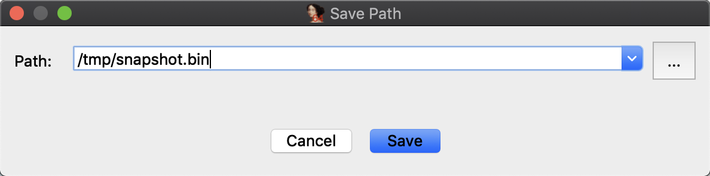
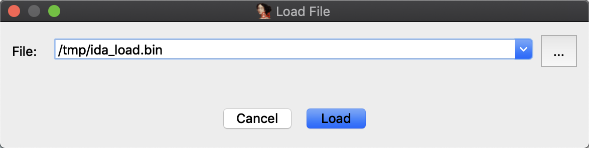
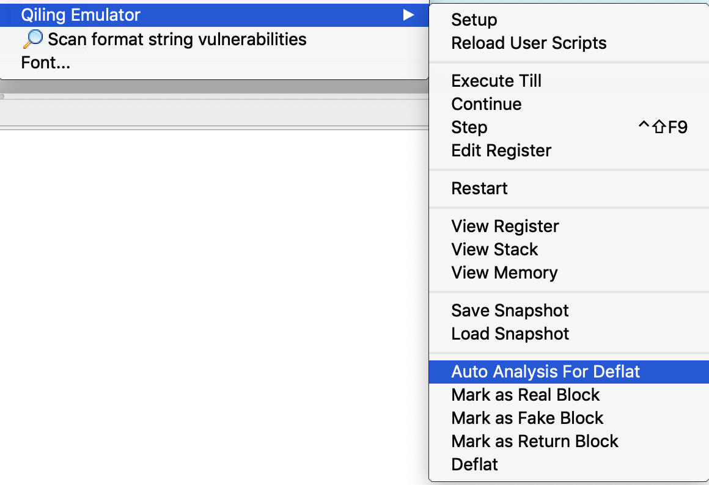
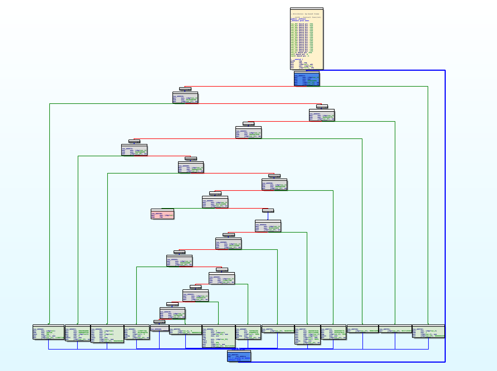
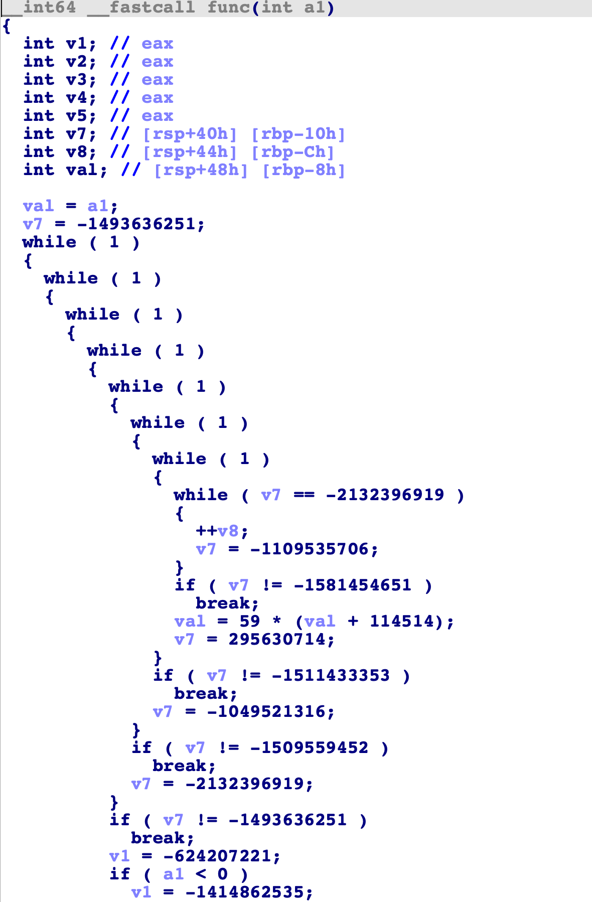
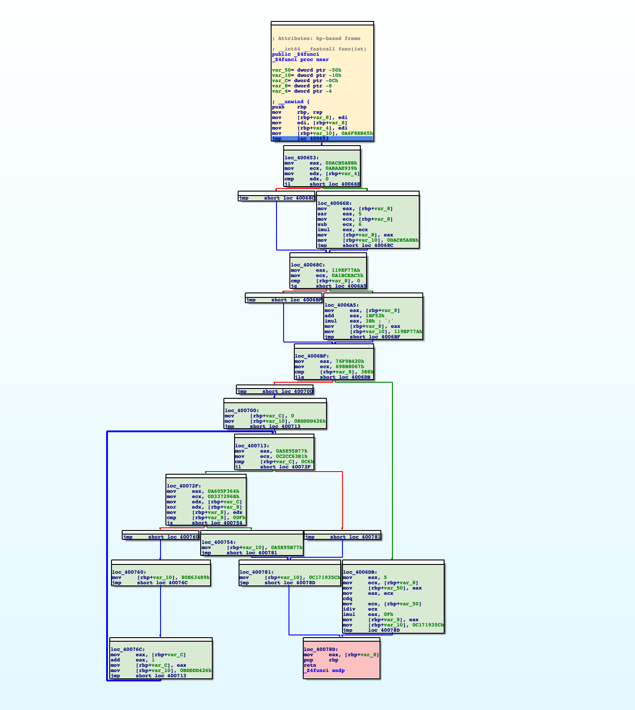
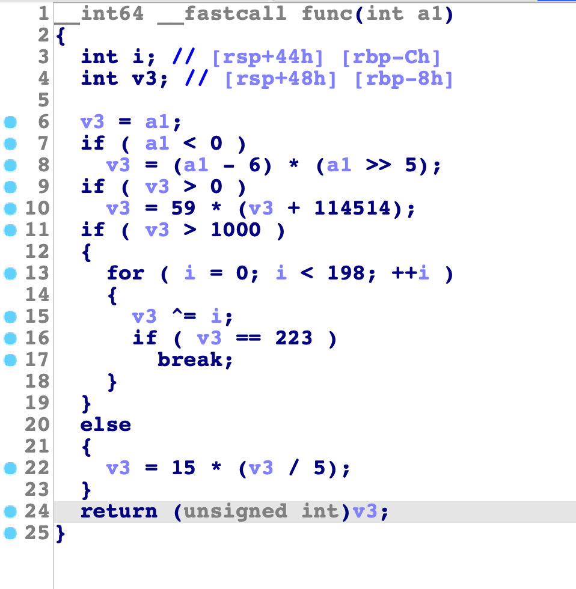

### Introduction

[IDA Pro](https://www.hex-rays.com/products/ida/) is one of the most powerful static analysis tools while Qiling is a modern, advanced dynamic instrumentation analysis framework. To combine the advantages of both products, we present the Qiling IDA plugin, which enhances the experience of reverse engineering to a much higher level.

The main features of the plugin are:

- [Cross systems, platforms and architectures without any virtualization technology.](#cross-systems-platforms-and-architectures)
- [Load, run and debug the binary.](#load-run-and-debug)
- [View register, stack and memory in standalone windows.](#debug)
- [Custom user scripts.](#custom-user-scripts)
- [Program snapshots.](#save-and-load-snapshot)
- [Ollvm de-obfuscation support.](#ollvm-de-obfuscation)

A demo video about decrypting Mirai's secret with Qiling IDA plugin is available below:

[](https://www.youtube.com/watch?v=ZWMWTq2WTXk)

### Installation

Before installing the plugin, Qiling should be installed properly, either a stable version or a dev version. See [installation](install.md) for details.

There are two ways to install the plugin.

#### Use as an IDA Pro plugin

- Make a symbol link to IDA Pro `plugins` directory.

```bash
# Linux
ln -s /absolute/path/to/qiling/extensions/idaplugin/qilingida.py /path/to/your/ida/plugins/

# Macos
ln -s /absolute/path/to/qiling/extensions/idaplugin/qilingida.py /Applications/<Your IDA>/ida.app/Contents/MacOS/plugins/

# Windows
mklink C:\absolute\path\to\IDA\plugins\qilingida.py D:\absolute\path\to\qiling\extensions\idaplugin\qilingida.py
```

Copying `qilingida.py` to IDA Pro plugin folder directly will also work, but considering the development of Qiling is always on the fast ring, a symbol link can save lots of tedious copy-and-paste work.

#### Use as a script file

- Start IDA Pro, click `File/Script file...`, choose the `qilingida.py` and the plugin will be loaded automatically.

Once loaded, the plugin is available under "Edit->Plugins->Qiling Emulator" and popup menu.

The plugin supports IDA Pro 7.x with Python3.6+.

Recommended platforms: MacOS & Linux

### Cross systems, platforms and architectures

Most emulation is supported natively by Qiling Framework, Below is a table for details.

| |8086|x86|x86-64|ARM|ARM64|MIPS|
|---|---|---|---|---|---|---|
| Windows (PE)    | -       | &#9745; | &#9745; | -       | &#9744; | -       |
| Linux (ELF)     | -       | &#9745; | &#9745; | &#9745; | &#9745; | &#9745; |
| MacOS (MachO)   | -       | &#9744; | &#9745; | -       | &#9744; | -       |
| BSD (ELF)       | -       | &#9744; | &#9745; | &#9744; | &#9744; | &#9744; |
| UEFI            | -       | &#9745; | &#9745; | -       | -       | -       |
| DOS (COM)       | &#9745; | -       | -       | -       | -       | -       |
| MBR             | &#9745; | -       | -       | -       | -       | -       |

- \- : Not apply.
- &#9744;: Not supported.
- &#9745;: Support.

### Load, run and debug

#### Setup

To run the current binary in IDA with Qiling, two things are supposed to be provided: rootfs and user custom script.

`rootfs` is the root directory of emulated environment. Usually, the `/path/to/qiling/examples/rootfs/<arch>` directory should work for most cases. `user custom script` provides custom callbacks before running the binary, continuing or single stepping and a good example can be found [here](https://github.com/qilingframework/qiling/blob/dev/qiling/extensions/idaplugin/examples/custom_script.py).

To setup the plugin, right click at anywhere and find "Qiling Emulator".

{: style="height: 400px"}

Select "setup first" and a window is pop up for the `rootfs` and `custom user script`.

{: style="width: 60%"}

A successful load will prompts "User Script Load" in the output window below. Otherwise, "There Is No User Scripts" will show up in the output window instead.

{: style="width: 60%"}

#### Load and run

At this time, Qiling has finished parsing the binary, loading it into the memory, setting the PC to the entry point and preparing everthing ready for the following execution. Thus, user only needs to click `Continue` in the menu and Qiling will run the target binary from the entry point to the end. At the same time, Qiling IDA plugin will render the executed path to green for later analysis.

{: style="height: 400px"}

To restart the emulation, select `Restart` in the menu and fill in the `rootfs` and `custom user script` again.

Except simply loading and running the binary, the Qiling IDA plugin is also capable of debugging the binary.

For example, to execute until current position, simply right-click at any address (e.g. 0x804851E for the screenshot below) and select `Execute Till`. Qiling will stop at your cursor as well as color its path with a different color.

{: style="height: 400px"}

#### Debug

To view registers and stack, select `View Register` and `View Stack`.

{: style="height: 500px"}

To view Memory, click `View Memory` and fill in the address and size of memory.

{: style="width: 60%"}

{: style="width: 60%"}

Click `Step` or press `CTRL+SHIFT+F9` to let Qiling step a single instruction. Note the register view and stack view mentioned just now will be updated synchronically.

{: style="height: 500px"}

IDA breakpoints are also supported. Press `F2` to set a breakpoint, select `Continue` and Qiling will stop at the breakpoint.

{: style="height: 400px"}

CPU registers can also be edited in the register view window. Right-click on the register, select `Edit Register` and input new value.

{: style="width: 60%"}

### Custom user scripts

Below is a minimum custom user scripts without any special functions.

```python
from qiling import *

class QILING_IDA():
    def __init__(self):
        pass

    def custom_prepare(self, ql):
        pass

    def custom_continue(self, ql:Qiling):
        hook = []
        return hook

    def custom_step(self, ql:Qiling):
        hook = []
        return hook
```

Except for `__init__`, the three other functions will be called in specific time to allow users to have a better control of the execution.

- `custom_prepare` will be called before the plugin calls `ql.run`.
- `custom_continue` will be called when user would like to continue execution.
- `custom_step` will be called when user steps an instruction.

Below is a slightly complicated example.

```python
from qiling import *


class QILING_IDA():
    def __init__(self):
        pass

    def custom_prepare(self, ql):
        print('set something before ql.run')

    def custom_continue(self, ql:Qiling):
        def continue_hook(ql, addr, size):
            print(hex(addr))

        print('user continue hook')
        hook = []
        hook.append(ql.hook_code(continue_hook))
        return hook

    def custom_step(self, ql:Qiling):
        def step_hook1(ql, addr, size):
            print(hex(addr))

        def step_hook2(ql):
            print('arrive to 0x0804845B')

        print('user step hook')
        hook = []
        hook.append(ql.hook_code(step_hook1))
        hook.append(ql.hook_address(step_hook2, 0x0804845B))
        return hook
```

Note that the hook list is returned since the plugin will delete user's hooks after each action.

Below are the screenshots when user tries to step an instruction

{: style="height: 400px"}

and when user tries to continue.

{: style="height: 300px"}

The plugin can also reload user scripts dynamically. Edit and save your script, select `Reload User Scripts` and all modifications will take effect.

### Save and load snapshot

A snapshot is a save of current context, which can be restored anytime in a second. To save a snapshot, select `Save Snapshot` from menu and fill in the path.



To restore a snapshot, select `Load Snapshot`.



### Ollvm de-obfuscation

#### De-flatten

[ollvm](https://github.com/obfuscator-llvm/obfuscator) is an obfuscator based on LLVM. One of its obfuscation technique is [Control Flow Flattening](https://github.com/obfuscator-llvm/obfuscator/wiki/Control-Flow-Flattening). With Qiling IDA plugin, such flattened control flows can be restored easily.

Note we use **Delaft** as an abbreviation of `De-flatten` in docs and plugin.

Control Flow Flattening will generate four types of blocks: real blocks, fake blocks, dispatcher blocks and return blocks

- Real blocks: The real logic in original binary
- Fake blocks: The fake logic in obfuscated code
- Dispatcher blocks: Something like `switch...case...case...` implementation, decide the following control flows
- Return blocks: The blocks which exit the function

To deflat the function, the first task is to identity such blocks. Qiling IDA plugin will perform some auto analysis by clicking `Auto Analysis For Deflat`. Note that [the basic setup](#Setup) should be done before analysis.

{: style="height: 400px"}

After that, the blocks of the function will be rendered with different colors:

Green: Real blocks.
Blue: Dispatcher blocks.
Gray: Fake blocks.
Pink: Return blocks.
Yellow: The first block.

{: style="height: 500px"}

In this stage, user is able to adjust the analysis result by marking the block as real, fake or return blocks.

During this stage, the result of IDA decompiler is almost impossible to read.

{: style="width: 60%"}

After each block is marked properly, select `Deflat` and the plugin will start to find real control flows between real blocks and remove all fake blocks and dispatcher blocks. Below is the result:

{: style="height: 500px"}

Pressing F5 now shows the decompiled code without any obfuscation.

{: style="height: 400px"}