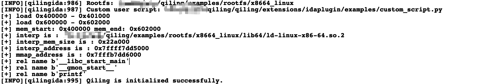
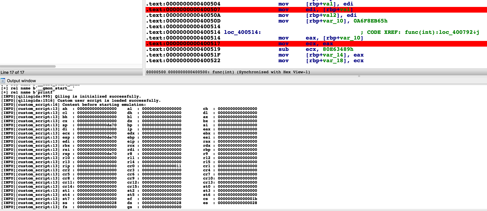
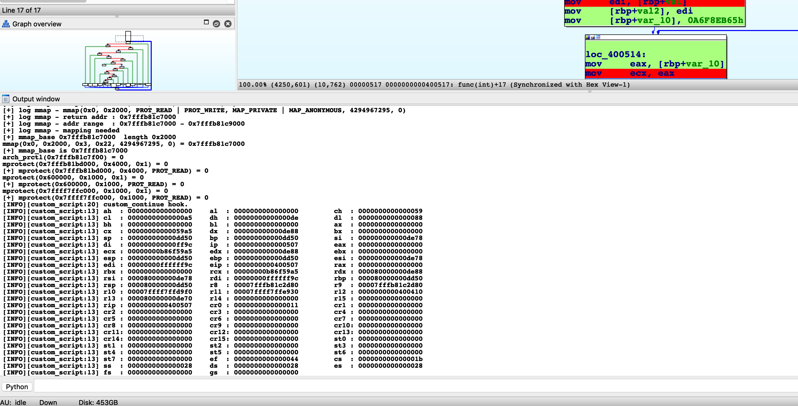
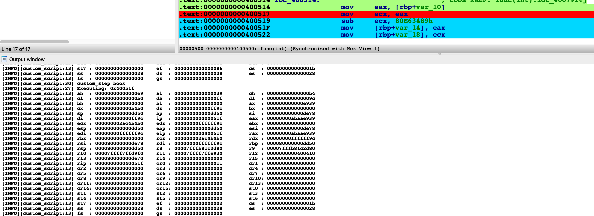
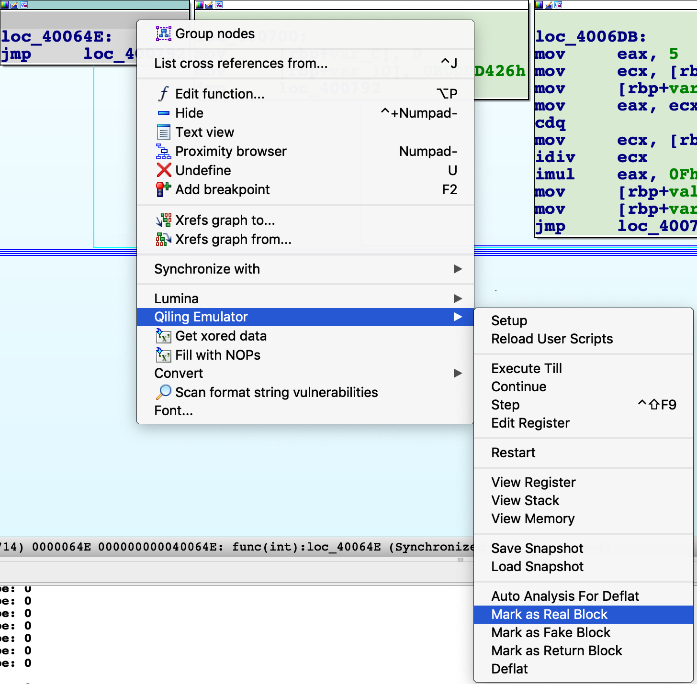

### Introduction

[IDA Pro](https://www.hex-rays.com/products/ida/)  is one of the most powerful static analysis tools, while Qiling is a modern, advanced dynamic. To combine the advantages of both products, we present the Qiling IDA plugin, which enhances the experience of reverse engineering to a much higher level.

The main features of the plugin are:

- [Support most architectures & system emulation and work without any virtualization technology.](#emulation-support)
- [Emulate current binary in IDA.](#load-emulate-debug)
- [View real-time emulation context in standalone windows.](#debug)
- [Custom user scripts to control the emulation.](#custom-user-scripts)
- [Save and load snapshots of emulation context.](#save-and-load-snapshot)
- [Deobfuscate code.](#de-obfuscation)

A demo video about decrypting Mirai's secret with Qiling IDA plugin is available below:

[](https://www.youtube.com/watch?v=ZWMWTq2WTXk)

### Installation

Before installing the plugin, Qiling should be installed properly. For now, installing from the "dev" branch of Qiling's repo is highly recommended.

```
pip3 install git+https://github.com/qilingframework/qiling@dev
```

There are two ways to install the plugin.

#### Use as an IDA Pro plugin

Make a symbol link to IDA Pro `plugins` directory.

**In case your system is different, replace these paths to the proper paths**
```bash
# Linux
ln -s ～/.local/lib/pyhon3.7/site-packages/qiling/extensions/idaplugin/qilingida.py /path/to/your/ida/plugins/

# Macos
ln -s /usr/local/lib/python3.7/site-packages/qiling/extensions/idaplugin/qilingida.py /Applications/<Your IDA>/ida.app/Contents/MacOS/plugins/

# Windows
mklink C:\absolute\path\to\IDA\plugins\qilingida.py C:\Programs Files(x86)\Python37\Lib\site-packages\qiling\extensions\idaplugin\qilingida.py
```

Copying `qilingida.py` from [dev branch](https://raw.githubusercontent.com/qilingframework/qiling/dev/qiling/extensions/idaplugin/qilingida.py) to IDA Pro plugin folder directly will also work, but considering the development of Qiling is always on the fast ring, a symbol link can save lots of tedious copy-and-paste work.

#### Use as a script file

Start IDA Pro, click `File/Script file...` from the menu, choose the location of `qilingida.py` and the plugin will be loaded automatically.

Once loaded, the plugin is available under "Edit->Plugins->Qiling Emulator" and pop-up menu.

The plugin supports IDA Pro 7.x with Python3.6+.

Recommend platforms: macOS & Linux(including WSL2).

!!! warning
    Currently, due to [a Unicorn bug](https://github.com/unicorn-engine/unicorn/issues/1316), Qiling is very unstable on native Windows, but WSL2 should always work.

### Emulation support

Most emulation is supported natively by Qiling Framework. Below is a table for details.

| |8086|x86|x86-64|ARM|ARM64|MIPS|
|---|---|---|---|---|---|---|
| Windows (PE)    | -       | &#9745; | &#9745; | -       | &#9744; | -       |
| Linux (ELF)     | -       | &#9745; | &#9745; | &#9745; | &#9745; | &#9745; |
| MacOS (MachO)   | -       | &#9744; | &#9745; | -       | &#9744; | -       |
| BSD (ELF)       | -       | &#9744; | &#9745; | &#9744; | &#9744; | &#9744; |
| UEFI            | -       | &#9745; | &#9745; | -       | -       | -       |
| DOS (COM)       | &#9745; | -       | -       | -       | -       | -       |
| MBR             | &#9745; | -       | -       | -       | -       | -       |

- \- : Not apply.
- &#9744;: Not supported.
- &#9745;: Support.

### Load, emulate & debug

#### Setup

To emulate current binary in IDA Pro with Qiling, two things are supposed to be provided: `rootfs` and `custom user script`.

`rootfs` is the root directory of the emulated environment. Usually, the `/path/to/qiling/examples/rootfs/<arch>` directory should work for most cases. `custom user script` provides some custom callbacks before emulating the binary, continuing, or single-stepping. A good example can be found [here](https://github.com/qilingframework/qiling/blob/dev/qiling/extensions/idaplugin/examples/custom_script.py).

To setup the plugin, right-click anywhere and choose the submenu `Qiling Emulator` from the pop-up menu.

[{: style="height:auto;width:500px;display:block;margin:left"}](img/ida1.png)

Select `Setup` from the menu, pop-up window will appear and ask for `rootfs` and `custom user script`

[{: style="height:auto;width:500px;display:block;margin:left"}](img/ida2.png)

A successful load will print "Qiling is initialized successfully" in the output window below. Otherwise, "ERROR: Qiling should be setup firstly." will show up in the output window instead.

[{: style="height:auto;width:500px;display:block;margin:left"}](img/ida20.png)

#### Load and emulate

At this time, Qiling has finished parsing the binary, loading it into the memory, setting the PC to the entry point, and preparing everything ready for the following emulation. Thus, user only needs to click `Continue` in the menu and Qiling will run the target binary from the entry point to the end. At the same time, Qiling IDA plugin will render the executed path to green for later analysis.

[{: style="height:auto;width:500px;display:block;margin:left"}](img/ida4.png)

To restart the emulation, select `Restart` in the menu and fill in the `rootfs` and `custom user script` again.

#### Debug

Besides emulating the binary, the Qiling IDA plugin is also capable of debugging the binary in the emulated environment.

For example, to execute until current position, simply right-click at any address (e.g. 0x804851E for the screenshot below) and select the menu `Execute Till`. Qiling will stop at your cursor as well as color its path with a different color.

[{: style="height:auto;width:500px;display:block;margin:left"}](img/ida6.png)

To view registers and stack, select `View Register` and `View Stack` in the menu.

[{: style="height:auto;width:500px;display:block;margin:left"}](img/ida7.png)

To view Memory, click the menu `View Memory` and fill in the address and size of memory.

[{: style="height:auto;width:500px;display:block;margin:left"}](img/ida8.png)

[{: style="height:auto;width:500px;display:block;margin:left"}](img/ida9.png)

Click the menu `Step` or press `CTRL+SHIFT+F9` to let Qiling step a single instruction. Note the register view and stack view mentioned just now will be updated synchronically.

[{: style="height:auto;width:500px;display:block;margin:left"}](img/ida10.png)

IDA breakpoints are also supported. Press `F2` to set a breakpoint, select menu `Continue` and Qiling will stop at the breakpoint.

[{: style="height:auto;width:500px;display:block;margin:left"}](img/ida12.png)

CPU registers can also be edited in the register view window. Right-click on the register, select menu `Edit Register` and input new value.

[{: style="height:auto;width:500px;display:block;margin:left"}](img/ida13.png)

### Custom user scripts

`Custom user scripts` is for users to implement their own logic when the Qiling IDA plugin emulates, continues or steps.

Below is a minimum custom user scripts without any special functions.

```python
from qiling import *

class QILING_IDA():
    def __init__(self):
        pass

    def custom_prepare(self, ql):
        pass

    def custom_continue(self, ql:Qiling):
        hook = []
        return hook

    def custom_step(self, ql:Qiling):
        hook = []
        return hook
```

Except for `__init__`, the three other functions will be called in specific times to allow users to have better control of the execution.

- `custom_prepare` will be called before the plugin calls `ql.run`.
- `custom_continue` will be called when user would like to continue execution.
- `custom_step` will be called when user steps an instruction.

Below is a slightly complicated example, which logs current context before emulation and every time Qiling continues or steps.

```python
from qiling import *
import logging

class QILING_IDA():
    def __init__(self):
        pass

    # Log all registers to console.
    def _show_context(self, ql:Qiling):
        registers = [ k for k in ql.reg.register_mapping.keys() if type(k) is str ]
        for idx in range(0, len(registers), 3):
            regs = registers[idx:idx+3]
            s = "\t".join(map(lambda v: f"{v:4}: {ql.reg.__getattribute__(v):016x}", regs))
            logging.info(s)
    
    # Before emulation
    def custom_prepare(self, ql:Qiling):
        logging.info('Context before starting emulation:')
        self._show_context(ql)

    # Continue
    def custom_continue(self, ql:Qiling):
        logging.info('custom_continue hook.')
        self._show_context(ql)
        hook = []
        return hook

    # Step
    def custom_step(self, ql:Qiling):
        def step_hook(ql, addr, size):
            logging.info(f"Executing: {hex(addr)}")
            self._show_context(ql)

        logging.info('custom_step hook')
        hook = []
        hook.append(ql.hook_code(step_hook))
        return hook
```

Note that the hook list is returned since the plugin will delete user's hooks after each action.

Below is a screenshot when the plugin loads `rootfs` and `custom user script`.

[{: style="height:auto;width:600px;display:block;margin:left"}](img/ida17.png)

When user choose "Continue", the current CPU context will be logged.

[{: style="height:auto;width:600px;display:block;margin:left"}](img/ida18.png)

Every time you step an instruction, the output window is updated with the latest CPU context.

[{: style="height:auto;width:600px;display:block;margin:left"}](img/ida19.png)

The plugin can also reload user scripts dynamically. Edit and save your script, select `Reload User Scripts` from the menu and all modifications will take effect immediately.

### Save and load snapshot

A snapshot is a save of current context, which can be restored anytime in a second. To save a snapshot, select `Save Snapshot` from the menu and fill in the path.

{: style="height:auto;width:500px;display:block;margin:left"}

To restore a snapshot, select `Load Snapshot` in the menu.

{: style="height:auto;width:500px;display:block;margin:left"}

### De-obfuscation

Obfuscation is a most common software protection technique to deliberately make the source or machine code hard to understand. Thanks to the IDA powerful CFG API, Qiling IDA plugin can implement multiple de-obfuscation techniques with a mixture of static and dynamic analysis.

Currently, Qiling IDA plugin supports [ollvm de-flatten](#ollvm-de-flatten) technique, and can restore original pseudo codes with the help of IDA decompiler.

#### Ollvm de-flatten

[ollvm](https://github.com/obfuscator-llvm/obfuscator) is an obfuscator based on LLVM. One of its obfuscation technique is [Control Flow Flattening](https://github.com/obfuscator-llvm/obfuscator/wiki/Control-Flow-Flattening). With Qiling IDA plugin, such flattened control flows can be restored easily.

!!! note
    We use **Deflat** as an abbreviation of `De-flatten` in docs and plugin.

Control Flow Flattening will generate four types of blocks: real blocks, fake blocks, dispatcher blocks and return blocks

- Real blocks: Blocks that contain the real logic in original code.
- Fake blocks: Blocks that contain the fake logic in obfuscated code. They are intended to cooperate with dispatcher blocks to obfuscate original control flows and don't contain any real logic in original code.
- Dispatcher blocks: Blocks that contain `switch...case...case...` implementation, decide the following control flows.
- Return blocks: Blocks which exit the function.

To deflat the function, the first task is to identify such blocks. Qiling IDA plugin will perform some auto analysis by clicking `Auto Analysis For Deflat`. Note that [the basic setup](#setup) should be done before analysis.

[{: style="height:auto;width:500px;display:block;margin:left"}](img/deflat.png)

After that, the blocks of the function will be rendered with different colors:

- Green: Real blocks.
- Blue: Dispatcher blocks.
- Gray: Fake blocks.
- Pink: Return blocks.
- Yellow: First block.

[{: style="height:auto;width:500px;display:block;margin:left"}](img/deflat2.png)

In this stage, user may adjust the analysis result by marking the block as real, fake or return blocks. For example, to mark a block as a real block, click "Mark as Real Block" in the pop-up menu.

[{: style="height:auto;width:500px;display:block;margin:left"}](img/deflat6.png)

At this stage, the output of IDA decompiler is hard to understand.

[{: style="height:auto;width:500px;display:block;margin:left"}](img/deflat3.png)

After each block is marked properly, select "Deflat" menu. The plugin will start discovering real control flows between real blocks, then remove all fake blocks and dispatcher blocks. Below is the result:

[{: style="height:auto;width:500px;display:block;margin:left"}](img/deflat4.png)

Pressing F5 now shows the decompiled code without any obfuscation.

[{: style="height:auto;width:500px;display:block;margin:left"}](img/deflat5.png)

References:

- [https://blog.quarkslab.com/deobfuscation-recovering-an-ollvm-protected-program.html](https://blog.quarkslab.com/deobfuscation-recovering-an-ollvm-protected-program.html)
- [http://ac.inf.elte.hu/Vol_030_2009/003.pdf](http://ac.inf.elte.hu/Vol_030_2009/003.pdf)