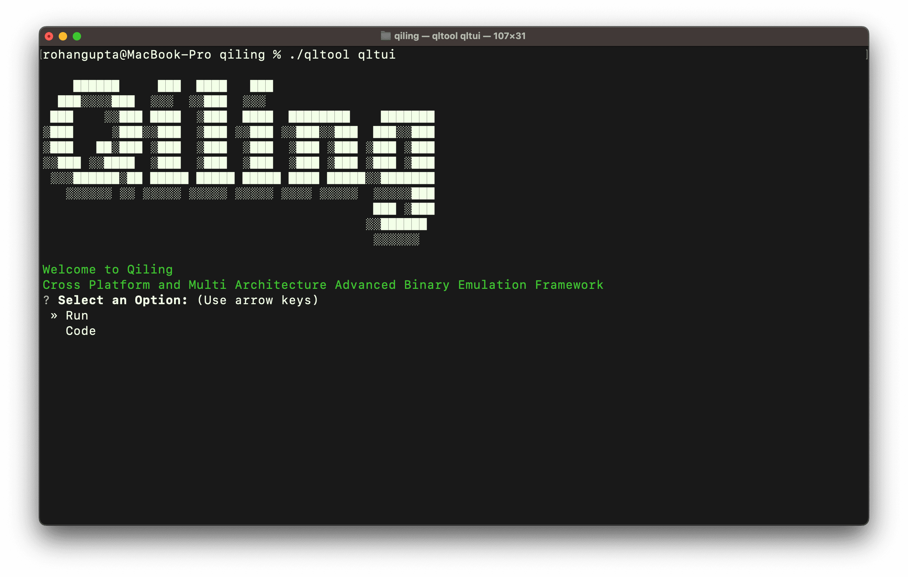
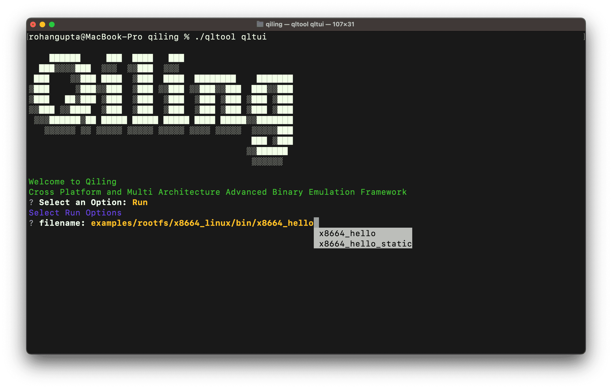
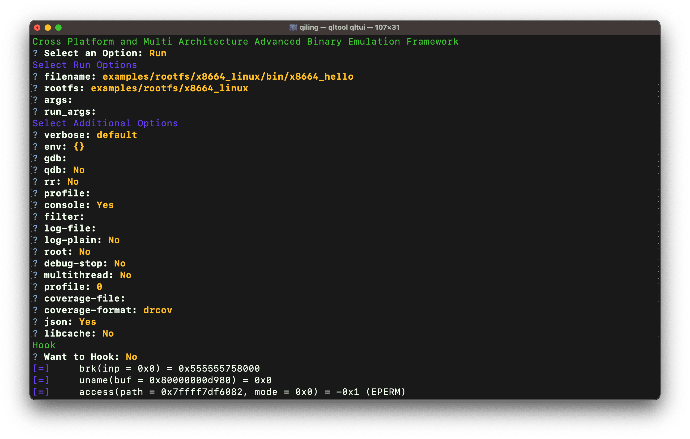
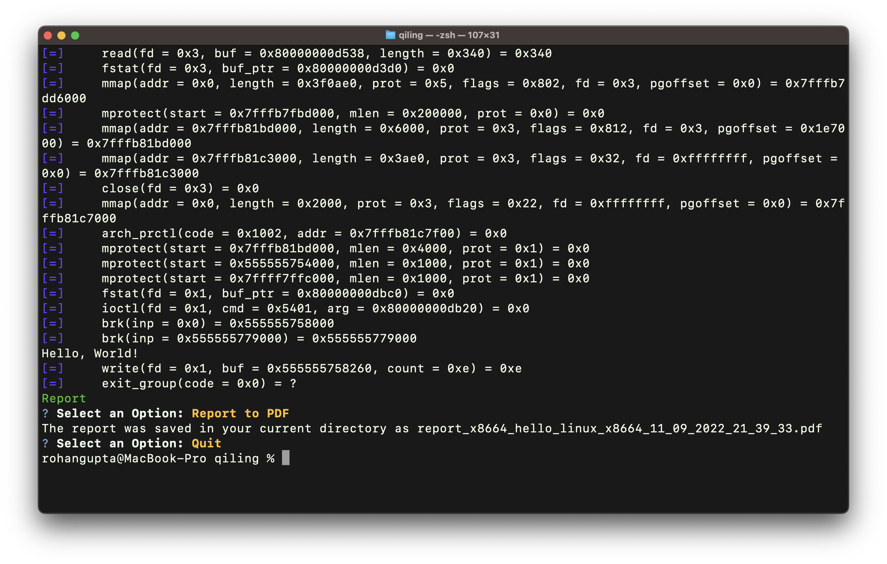
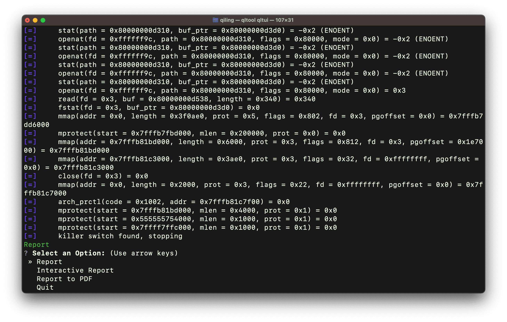
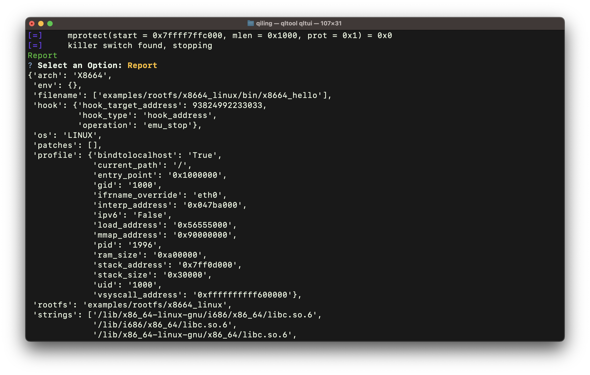

Qiling Framework also provides a friendly tool named `qltool` to quickly emulate shellcode & executable binaries.

## Commands
`qltool` has three available commands:
- `run`: to emulate a program binary
- `code`: to execute a shellcode excerpt
- `qltui`: to show terminal user interface for qltool
- `examples`: to emit usage examples

## Run Options
<table>
    <thead>
        <tr>
            <th>Option name</th>
            <th>Abbreviation</th>
            <th>Arguments</th>
            <th>Description</th>
        </tr>
    </thead>
    <tbody>
        <tr>
            <td><code>--filename</code></td>
            <td><code>-f</code></td>
            <td><i>filename</i></td>
            <td>Binary filename to emulate</td>
        </tr>
        <tr>
            <td><code>--rootfs</code></td>
            <td></td>
            <td><i>dirname</i></td>
            <td>Emulation root directory; this is where all libraries reside</td>
        </tr>
        <tr>
            <td><code>--args</code></td>
            <td></td>
            <td><i>...</i></td>
            <td>Emulated program command line arguments</td>
        </tr>
    </tbody>
</table>

Notes:
- If `--filename` is not specified, the last argument will be considered as program binary
- If `--args` is not speified, all trailing arguments will be considered as program command line arguments

## Code Options
<table>
    <thead>
        <tr>
            <th>Option name</th>
            <th>Abbreviation</th>
            <th>Arguments</th>
            <th>Description</th>
        </tr>
    </thead>
    <tbody>
        <tr>
            <td><code>--filename</code></td>
            <td><code>-f</code></td>
            <td><i>filename</i></td>
            <td>Input filename</td>
        </tr>
        <tr>
            <td><code>--input</code></td>
            <td><code>-i</code></td>
            <td><i>hex</i></td>
            <td>Input hex string; only relevant when <code>--format</code> is set to <code>hex</code></td>
        </tr>
        <tr>
            <td><code>--format</code></td>
            <td></td>
            <td>
                <code>asm</code>,
                <code>hex</code>,
                <code>bin</code>
            </td>
            <td>Specify file or input format: either an assembly, hex string or binary file</td>
        </tr>
        <tr>
            <td><code>--arch</code></td>
            <td></td>
            <td>
                <code>x86</code>,
                <code>x8664</code>,
                <code>arm</code>,
                <code>arm_thumb</code>,
                <code>arm64</code>,
                <code>mips</code>,
                <code>a8086</code>,
                <code>evm</code>
            </td>
            <td>Target architecture</td>
        </tr>
        <tr>
            <td><code>--endian</code></td>
            <td></td>
            <td>
                <code>little</code>,
                <code>big</code>
            </td>
            <td>Target endianess (default: <code>little</code>)</td>
        </tr>
        <tr>
            <td><code>--os</code></td>
            <td></td>
            <td>
                <code>linux</code>,
                <code>freebsd</code>,
                <code>macos</code>,
                <code>windows</code>,
                <code>uefi</code>,
                <code>dos</code>,
                <code>evm</code>
            </td>
            <td>Target operating system</td>
        </tr>
    </tbody>
</table>

Notes:
- When `--format` is set to `hex`, `qltool` will first look for data in `--input`. If no input string specified, it will refer to the file specified in `--filename`

## Common Options
<table>
    <thead>
        <tr>
            <th>Option name</th>
            <th>Abbreviation</th>
            <th>Arguments</th>
            <th>Description</th>
        </tr>
    </thead>
    <tbody>
        <tr>
            <td><code>--verbose</code></td>
            <td><code>-v</code></td>
            <td>
                <code>off</code>,
                <code>default</code>,
                <code>debug</code>,
                <code>disasm</code>,
                <code>dump</code>
            </td>
            <td>Set logging verbosity level</td>
        </tr>
        <tr>
            <td><code>--env</code></td>
            <td></td>
            <td><i>filename</i></td>
            <td>Path of a Pickle file containing an environment dictionary, <b>or</b> a Python string that evaluates to a dictionary</td>
        </tr>
        <tr>
            <td><code>--gdb</code></td>
            <td><code>-g</code></td>
            <td>[<i>server:port</i>]</td>
            <td>Enable gdb server</td>
        </tr>
        <tr>
            <td><code>--qdb</code></td>
            <td></td>
            <td></td>
            <td>Attach qdb at entry point. Currently supporting only MIPS and ARM (thumb mode)</td>
        </tr>
        <tr>
            <td><code>--rr</code></td>
            <td></td>
            <td></td>
            <td>Enable qdb <i>record and replay</i> feature; requires `--qdb`</td>
        </tr>
        <tr>
            <td><code>--profile</code></td>
            <td></td>
            <td><i>filename</i></td>
            <td>Specify a profile file</td>
        </tr>
        <tr>
            <td><code>--no-console</code></td>
            <td></td>
            <td></td>
            <td>Do not emit program output to <i>stdout</i></td>
        </tr>
        <tr>
            <td><code>--filter</code></td>
            <td><code>-e</code></td>
            <td><i>regexp</i></td>
            <td>Apply a filtering regexp on log output</td>
        </tr>
        <tr>
            <td><code>--log-file</code></td>
            <td></td>
            <td><i>filename</i></td>
            <td>Emit log to file</td>
        </tr>
        <tr>
            <td><code>--log-plain</code></td>
            <td></td>
            <td></td>
            <td>Do not use colors in log output; useful when emitting log to a file</td>
        </tr>
        <tr>
            <td><code>--root</code></td>
            <td></td>
            <td></td>
            <td>Enable <i>sudo required</i> mode</td>
        </tr>
        <tr>
            <td><code>--debug-stop</code></td>
            <td></td>
            <td></td>
            <td>Stop emulation on first error; requires <code>verbose</code> to be set to either <code>debug</code> or <code>dump</code></td>
        </tr>
        <tr>
            <td><code>--multithread</code></td>
            <td><code>-m</code></td>
            <td></td>
            <td>Execute program in multithread mode</td>
        </tr>
        <tr>
            <td><code>--timeout</code></td>
            <td></td>
            <td><i>microseconds</i></td>
            <td>Set emulation timeout in microseconds (1000000μs = 1s)</td>
        </tr>
        <tr>
            <td><code>--coverage-file</code></td>
            <td><code>-c</code></td>
            <td><i>filename</i></td>
            <td>Code coverage output file</td>
        </tr>
        <tr>
            <td><code>--coverage-format</code></td>
            <td></td>
            <td>
                <code>drcov</code>,
                <code>drcov_exact</code>
            </td>
            <td>Code coverage file format</td>
        </tr>
        <tr>
            <td><code>--json</code></td>
            <td></td>
            <td></td>
            <td>Emit an emulation report in JSON format</td>
        </tr>
    </tbody>
</table>

## qltui

A Terminal User Interface for `qltool`.

-   Runs on top of  `qltool`.
-   Accept data using an interface for  `run`  and  `code`  commands.
-   Returns an  `Argparse Namespace`  object back to  `qltool`  for execution.
-   Interactive report viewer plus an option to save it as a pdf.

### qltui in action









## Examples

### shellcode:

```bash
$ ./qltool code --os linux --arch arm --format hex -f examples/shellcodes/linarm32_tcp_reverse_shell.hex
$ ./qltool code --os linux --arch x86 --format asm -f examples/shellcodes/lin32_execve.asm
```

### binary file:

```bash
$ ./qltool run -f examples/rootfs/x8664_linux/bin/x8664_hello --rootfs  examples/rootfs/x8664_linux/
$ ./qltool run -f examples/rootfs/mips32el_linux/bin/mips32el_hello --rootfs examples/rootfs/mips32el_linux
```

### UEFI file:

```bash
$ ./qltool run -f examples/rootfs/x8664_efi/bin/TcgPlatformSetupPolicy --rootfs examples/rootfs/x8664_efi --env examples/rootfs/x8664_efi/rom2_nvar.pickel
```

### GDB debugger enable:

```bash
$ ./qltool run -f examples/rootfs/x8664_linux/bin/x8664_hello --gdb 127.0.0.1:9999 --rootfs examples/rootfs/x8664_linux
```

### Binary file and argv:

```bash
$ ./qltool run -f examples/rootfs/x8664_linux/bin/x8664_args --rootfs examples/rootfs/x8664_linux --args test1 test2 test3
$ ./qltool run --rootfs examples/rootfs/x8664_linux examples/rootfs/x8664_linux/bin/x8664_args test1 test2 test3
```

### Binary file and various output format:

```bash
$ ./qltool run -f examples/rootfs/mips32el_linux/bin/mips32el_hello --rootfs examples/rootfs/mips32el_linux --verbose disasm
```

### Binary file and env:
```bash
$ ./qltool run -f jexamples/rootfs/x8664_linux/bin/tester --rootfs jexamples/rootfs/x8664_linux --env '{"LD_PRELOAD":"hijack.so"}' --verbose debug
```

### qltui
```bash
$ ./qltool qltui
```
